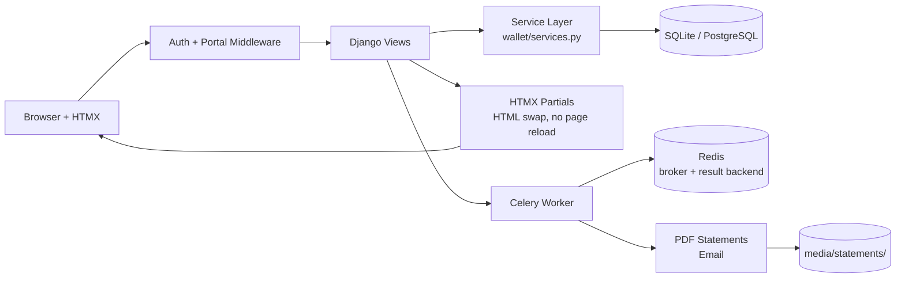
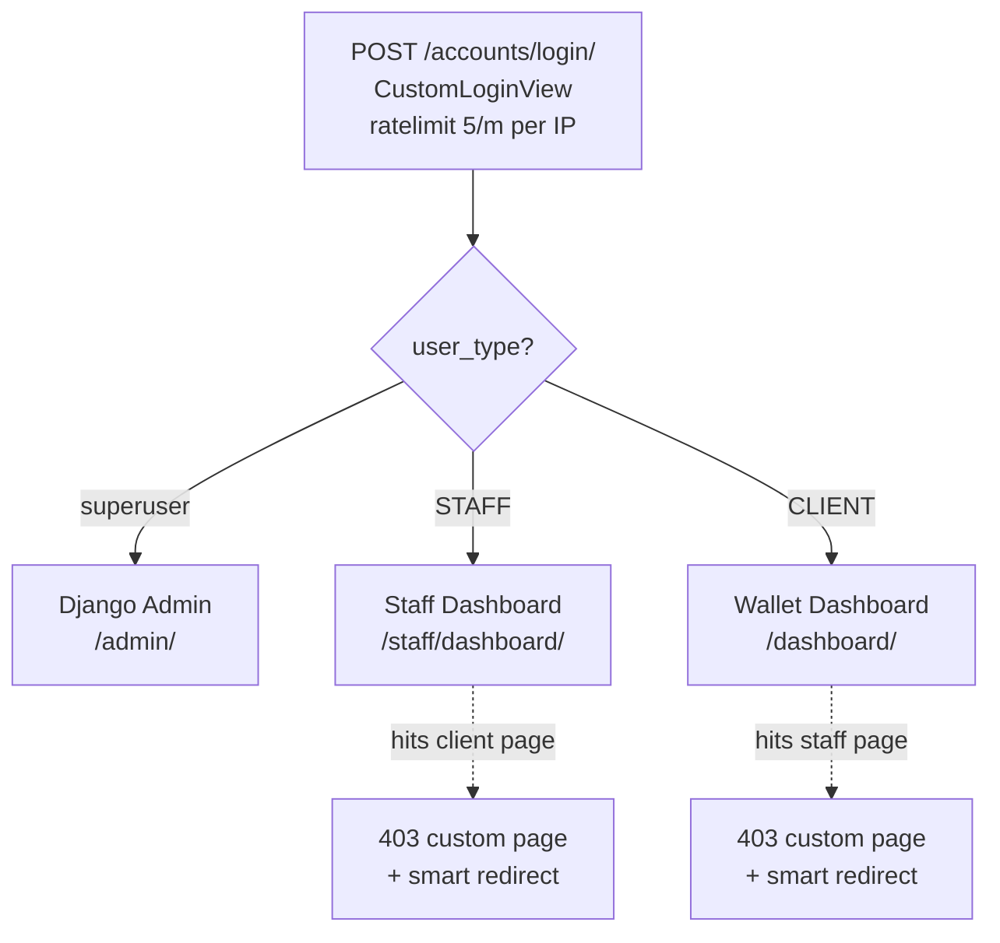
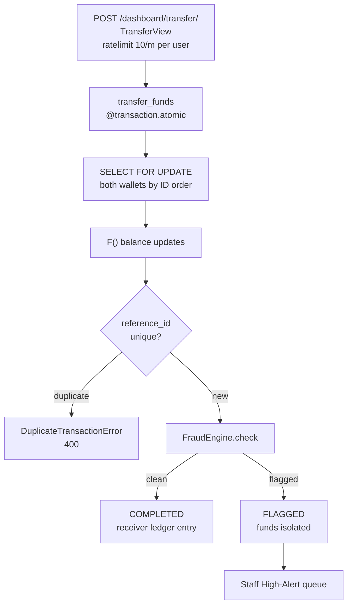
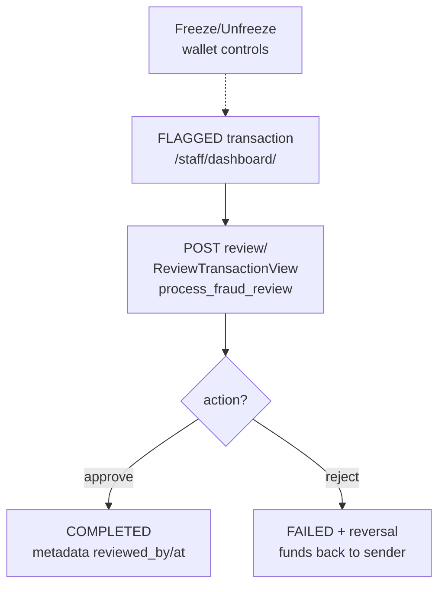
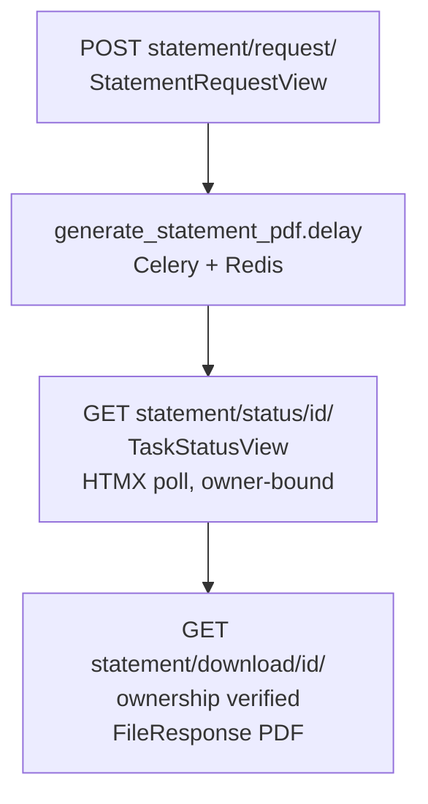
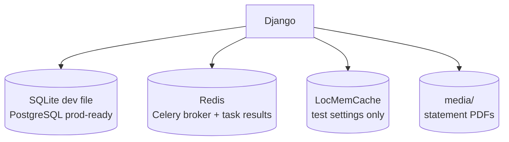

# Architecture

Core modules, tech stack, business rules, and workflow for Digital Wallet Dashboard.

---

## Core Modules

| App          | Purpose                                                                             |
|--------------|-------------------------------------------------------------------------------------|
| `accounts`   | Authentication, custom user model, profiles, password reset, security/profile pages |
| `wallet`     | Wallet model, transactions, dashboard, deposits, withdrawals, transfers, statements |
| `operations` | Staff dashboard, fraud review, wallet freeze/unfreeze                               |
| `analytics`  | Staff analytics dashboards and Chart.js data endpoints                              |
| `core`       | Settings, root URLs, environment configuration, Celery bootstrap                    |

---

## Tech Stack

| Layer        | Technology                                                                  |
|--------------|-----------------------------------------------------------------------------|
| Backend      | Python 3.12, Django 5.2                                                     |
| Database     | SQLite for local development, PostgreSQL-ready configuration for production |
| Frontend     | Django Templates, HTMX, custom modular CSS, Vanilla JavaScript              |
| Auth         | Custom email-based `CustomUser`                                             |
| Async        | Celery, Redis                                                               |
| Reporting    | ReportLab PDF generation                                                    |
| Analytics    | Chart.js                                                                    |
| Testing      | Pytest, pytest-django, pytest-cov                                           |
| Code Quality | pre-commit, black, flake8, isort, ruff, mypy + django-stubs                |
| Rate Limit   | django-ratelimit (login 5/m ip, transfer/withdraw 10/m user, reset 3/m ip) |
| Ops          | `/health/` endpoint, GitHub Actions CI + security scan                      |

---

## System Blueprint



## Auth & Portal Flow



## Transfer Flow (Happy Path + Flag)



## Fraud Review Flow



## Statement Flow (Async)



## Storage Layer



---

## Business Rules

### Wallet Operations

- Deposits, withdrawals, and transfers are handled through service-layer functions.
- Transfers isolate funds during fraud review to prevent double-spending.
- Rejected flagged transfers automatically reverse funds back to the sender.

### Fraud Review

The fraud engine flags suspicious transfers based on:

- Transfer amounts above the configured high-risk threshold ($10,000).
- Unusually high transaction frequency (> 5 transfers/hour).
- New accounts (< 7 days) making large transfers (> $1,000).

Flagged transfers are routed to the staff dashboard for manual review.

### Statements

- Statements are generated asynchronously via Celery.
- Progress is exposed through HTMX task status polling.
- Completed statements can be downloaded after ownership verification.

### Portal Separation

- Superusers are directed to Django admin.
- Staff users are directed to the staff dashboard.
- Client users are directed to the wallet dashboard.
- Unauthorized cross-portal access returns a custom 403 experience.

---

## Application Routes

| Area                     | Path           |
|--------------------------|----------------|
| Role-aware home redirect | `/`            |
| Django admin             | `/admin/`      |
| Accounts                 | `/accounts/`   |
| Client wallet portal     | `/dashboard/`  |
| Staff portal             | `/staff/`      |
| Analytics                | `/analytics/`  |

### Important Endpoints

- `/accounts/login/`
- `/accounts/register/`
- `/accounts/profile/`
- `/accounts/security/`
- `/dashboard/`
- `/dashboard/deposit/`
- `/dashboard/withdraw/`
- `/dashboard/transfer/`
- `/dashboard/transactions/`
- `/dashboard/statement/request/`
- `/staff/dashboard/`
- `/analytics/dashboard/`

---

## Project Structure

```text
DigitalWallet/
├── accounts/                  # Authentication, user model, profiles, security views
├── analytics/                 # Staff analytics dashboard and chart endpoints
├── core/                      # Settings, root URLs, Celery app bootstrap
├── operations/                # Staff dashboard and fraud review tools
├── scripts/                   # Setup, git workflow, manual helper scripts
├── static/                    # CSS, JS, frontend assets
├── templates/                 # Base templates, snippets, account/wallet/staff pages
├── wallet/                    # Wallet models, services, views, PDF tasks
├── .env.example               # Example environment configuration
├── manage.py
├── requirements.txt
└── requirements-dev.txt
```

---

## Git Workflow

This project uses helper scripts for phase-oriented workflow:

- `scripts/git-phase-commit.sh`
- `scripts/git-phase-merge.sh`

Role-based commit identities supported by the commit script:

- `dev` → Qwen-Coder
- `consult` → Gemini-CLI
- `review` → OpenAI-Codex
- `mgr` → Ahmad

Example:

```bash
./scripts/git-phase-commit.sh 8 "Title" "Description" review
```

---

## AI Collaboration Model

This repository documents a multi-agent workflow in `Constitution_Digital_Wallet.md`.

Primary roles:

- **Ahmad**: manager and final approver
- **Qwen**: implementation-focused developer AI
- **Gem**: consultant AI for architecture and planning
- **Cod**: reviewer AI for regression detection, verification, and support fixes

All AI-generated work is still expected to follow the same branch, testing, and approval rules as any other contribution.
